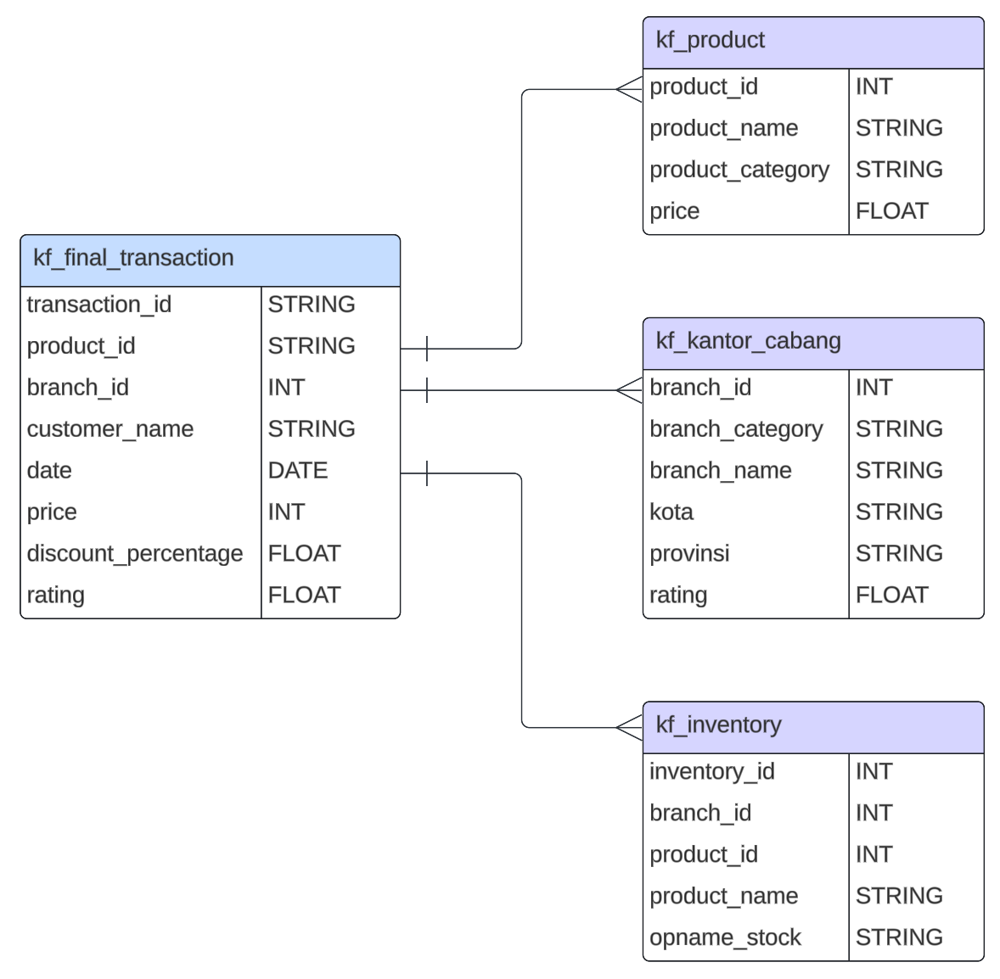

# Project-Based Virtual Intern: Big Data Analytics Kimia Farma x Rakamin Academy

## About The Program
The Program Project-Based Internship collaboration between **Rakamin Academy** and **Kimia Farma** Big Data Analytics is a self-development and career acceleration program aimed at those interested in delving into the position of Big Data Analytics at Kimia Farma. This program provides access to basic learning materials such as Article Reviews and Company Coaching Videos to introduce you to the competencies and skills required by Big Data Analytics professionals in the company. In addition to the materials, there will be assessments of your learning outcomes in the form of weekly Task questions, culminating in the creation of a final project that will serve as your portfolio for this program.

## About Kimia Farma
Kimia Farma is the first pharmaceutical industry company in Indonesia, founded by the Dutch East Indies government in 1817. The company's original name was NV Chemicalien Handle Rathkamp & Co. Based on the policy of nationalization of former Dutch companies in the early independence period, in 1958, the Republic of Indonesia government merged several pharmaceutical companies into PNF (State Pharmaceutical Company) Bhinneka Kimia Farma. Then on August 16, 1971, the legal form of PNF was changed to a Limited Liability Company, so the company's name was changed to PT Kimia Farma (Persero).

## Objective
The objective of the project is to evaluate the business performance of Kimia Farma from 2020 to 2023. Required to complete a series of challenges that involve importing data sets into BigQuery, creating analytical tables, and building a dashboard in Google Looker Studio.

## Challenges
- **Challenge 1**: Importing data sets into BigQuery. You will need to import four data sets provided by Kimia Farma.
- **Challenge 2**: Creating analytical tables in BigQuery. You will need to create a new table in BigQuery that combines the data from the four imported datasets.
- **Challenge 3**: Creating a performance dashboard in Google Looker Studio. You will need to create a dashboard in Google Looker Studio that visualizes the data from the analytical table you created in BigQuery.

## Dataset


## SQL Syntax

```SQL
# create new table
CREATE TABLE `kimia_farma.kf_analysis` AS
SELECT
    t.transaction_id,
    t.date,
    t.branch_id,
    c.branch_name,
    c.kota,
    c.provinsi,
    t.rating AS rating_transaction,
    t.customer_name,
    t.product_id,
    p.product_name,
    t.price,
    t.discount_percentage,
    # make a gross profit percentage based on price
    CASE 
        WHEN t.price <= 50000 THEN 0.1
        WHEN t.price > 50000 AND t.price <= 100000 THEN 0.15
        WHEN t.price > 100000 AND t.price <= 300000 THEN 0.2
        WHEN t.price > 300000 AND t.price <= 500000 THEN 0.25
        ELSE 0.3
    END AS gross_profit_percentage,
    (t.price * (1 - (t.discount_percentage / 100))) AS nett_sales, # count nett sales
    (t.price * (1 - (t.discount_percentage / 100)) * 
    CASE 
        WHEN t.price <= 50000 THEN 0.1
        WHEN t.price > 50000 AND t.price <= 100000 THEN 0.15
        WHEN t.price > 100000 AND t.price <= 300000 THEN 0.2
        WHEN t.price > 300000 AND t.price <= 500000 THEN 0.25
        ELSE 0.3
    END) AS nett_profit, # count nett profit
    c.rating AS rating_branch
FROM `kimia_farma.kf_final_transaction` t
JOIN `kimia_farma.kf_kantor_cabang` c ON t.branch_id = c.branch_id
JOIN `kimia_farma.kf_product` p ON t.product_id = p.product_id;
```
